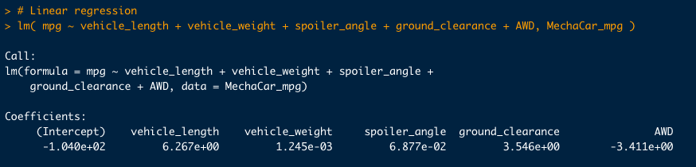
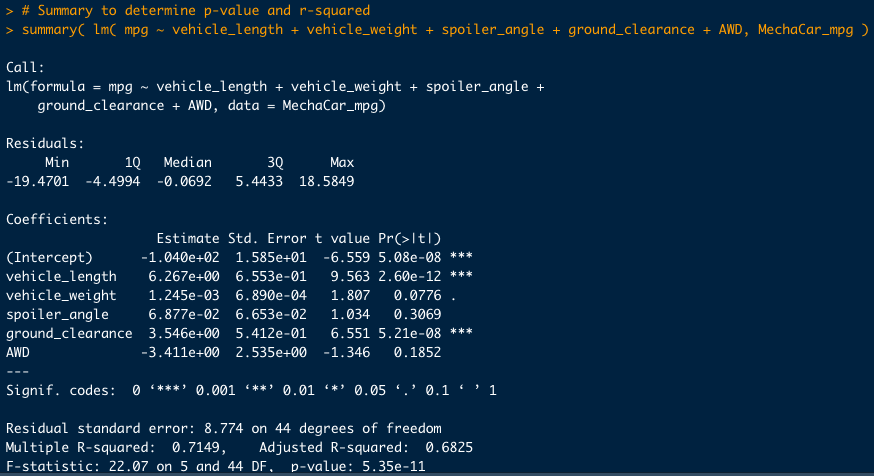
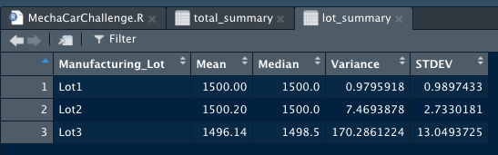
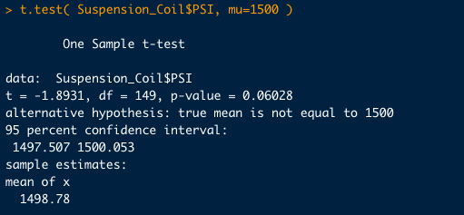
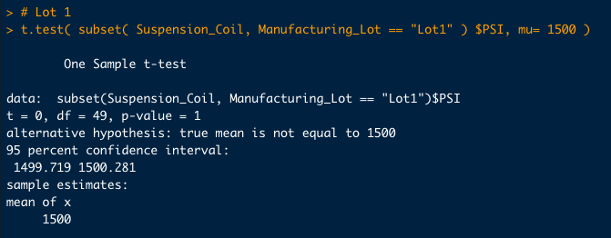
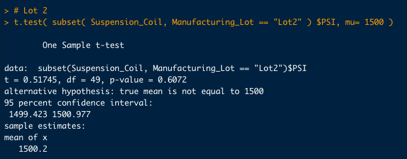

# MechaCar Statistical Analysis - Module 15 Challenge

## Overview
We will help the Data Analytics team to analyze some production problems of "AutosRU" and its new prototype, the MechaCar. We must deliver insights that will support the production team.

We will also compare the new MechaCar against its competition.

## Results 
### Linear Regression to Predict MPG
Linear regression model:

Summary of linear regression:

**Which variables/coefficients provided a non-random amount of variance to the mpg values in the dataset?**
Variables/coefficients "Vehicle_Length" and "Ground_Clearance" are statistically significant because their p-values are < 0.05. This also means these variables provide a non-random variance to the mpg value.

**Is the slope of the linear model considered to be zero? Why or why not?**
The slope is different from zero since the p-value of the model is 5.35e-11. This is below 0.05.

**Does this linear model predict mpg of MechaCar prototypes effectively? Why or why not?**
R-squared is equal to 0.7149. This is a big correlation in the dataset. I believe we can say this model can predict approximately 71% of the mpg for the MechaCar prototypes.

### Summary Statistics on Suspension Coils

Overall statitics:

Individual statistics:

The design specifications for the MechaCar suspension coils dictate that the variance of the suspension coils must not exceed 100 pounds per square inch. **Does the current manufacturing data meet this design specification for all manufacturing lots in total and each lot individually? Why or why not?**

By looking at the overall statistics, we can see a variance of 62.293 pounds. According to the DS (Design Specification), this value is acceptable (suspension coils must be below 100 pounds per square inch).

After reviewing individual lots, we realiza that LOT3 is exceeding the accepted value. Current variance is 170.286, which is higher than the specification.

### T-Tests on Suspension Coils

Please, see the image above. We ran some t-testing to verify the manufacturing lots as a whole, and the individual lots were statiscally different from the population mean of 1500 pounds per square inch.

Now, the individual lots:

After reviewing these tests, we can say LOT3 is (statiscally) different from the population mean (p-value < 0.05).

### Study Design: MechaCar vs Competition.
Comparing the MechaCar with its competition, will require a statistical study, and the enablement of some metrics describing the vehicles' performance in several aspects. When buying a car, I like to take a look into:

- Cost
- Maintenance costs
- Interior space
- Weight
- Safety ratings
- Combined fuel consumption

My **null hypothesis (Ho)** would be:
The performance of the MechaCar defined metrics Vs. the same metrics for the competition will not be different, making the car very similar and not offering a better performance in any of those aspects.

My **alternative Hypothesis (Ha)** would be:
The performance of the MechaCar defined metrics Vs. the same metrics for the competition are different, making the car very better or worst than the competition,

**Statistical tests**
1. We can find if there any differences in the selected variables by performing linear regressions. 
2. We can also perform an ANOVA test. This will help us to discover the performance of the MechaCar against its competition (considering the variables defined above). 

For this tests, we will need to gather random and significant data about the variables defined at the beggining of this section.